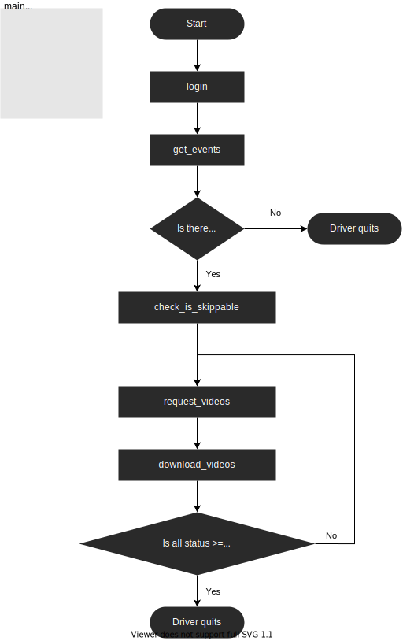
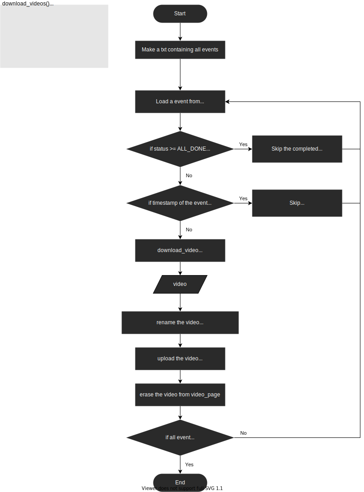

# Get Camera Video (POM)

- [Get Camera Video (POM)](#get-camera-video-pom)
  - [Introduction](#introduction)
  - [Workflow](#workflow)

## Introduction
A web crawler designed in Page Object Model (POM) in Selenium Python, and it gets videos from a stream website of a cctv (provided by Spotcam).

> Reference: [WebDriver Page Object Model Design Pattern 的一些想法](https://medium.com/drunk-wis/python-selenium-webdriver-page-object-model-design-pattern-%E7%9A%84%E4%B8%80%E4%BA%9B%E6%83%B3%E6%B3%95-6d8cc0e156a6)

## Workflow

